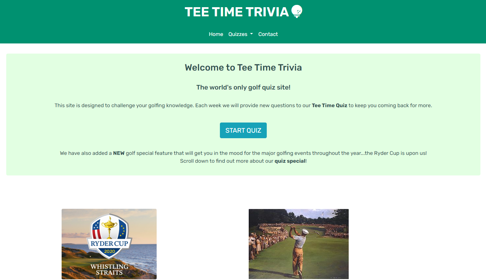
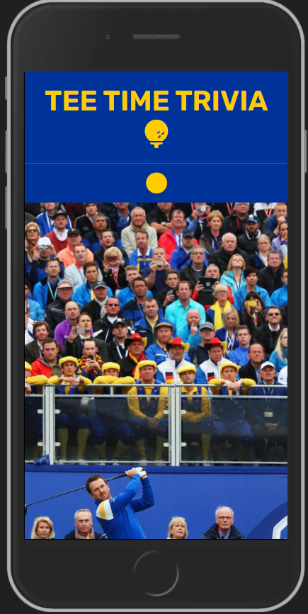
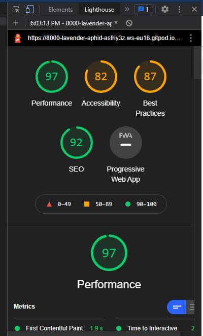
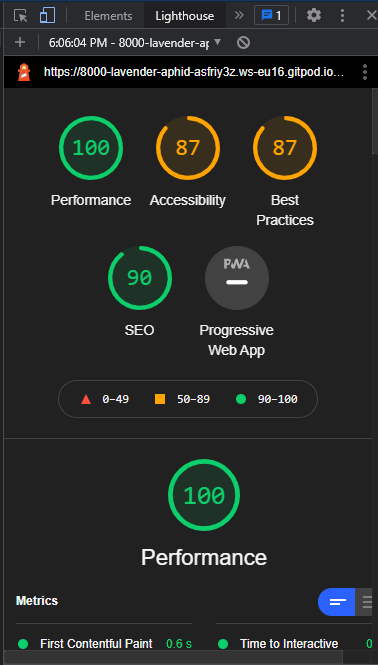

# Milestone Project 2

## Purpose 

The purpose of this site is to complete the second Milestone Project for the Code Institute's Full Stack Developer course and can can be found [here](https://cobobc.github.io/milestone_project_2/).

## Tee Time Trivia Website

Ciaran O'Brien has been requested to create a interactive golf quiz website. The website will challenge users on there general golfing knowledge and also - because it's a Ryder Cup year - test the users Ryder Cup knowledge.

## User Experience (UX)

### User stories

#### First Time User Goals

*   As a First Time user, I want to view clear and concise content on mobile and tablet.
*   As a First Time user, I want to learn and understand what the site offers.
*   As a First Time user, I want to understand the difference between the two quizzes.
*   As a First Time user, I want to seemlessly navigate through the 6 pages of the site.
*   As a First Time user, I want to easily connect with Tee Time Trivia's social platforms.
*   As a First Time user, I want to challenge my golfing knowledge.

#### Returning User Goals

*   As a Returning user, I want to continue to challenge my golfing knowledge with updated quiz questions.
*   As a Returning user, I want to be challanged with new quiz questions.
*   As a Returning user, I want to submit my score so I recieve a personal email with my score.

#### Frequent User Goals

The frequent user wants the following:

*   As a Frequent user, I want to use the email service to record all my results over a period of time.
*   As a Frequent user, I want to check for new quiz questions.

### Design

#### Colour Scheme

The main colours used are #009170 (green) and #000 (white). The green is a common colour associated with golf.
For the special quiz pages a #003399 (blue) and a #FFCC00 (yellow) are used. These colours are that of the EU flag and the European Ryder Cup team.

#### Font

The **Rubik** font is used through the whole site.

#### Imagery

The large background images used are sources from www.theindependent.ie and was granted permission to use for this project.

#### Wireframes

For complete wireframes see this [PDF](assets/images/read_me/Wireframes_m2.pdf).

### Limitations

There were no limitations.

## Features 

The features throughout the site are mininal text and larger text for clear navigation from quiz to quiz. Use of Bootstrap Jumbotrons helped achieve this idea.

### Existing Features

*   Navigation bar

    *   Featured identically on every page that contains links to the Home page, the 2 quizzes, and the Contact pages. The title in the nav bar provides the user with a link
        back to the home page. 
    *   The navigation options contains a dropdown feature that neatly houses links to the two quiz pages. This dropdown also extends to the mobile device with the Bootstrap burger icon.
    *   The navigation options becomes contained in a responsive Bootstrap burger icon for tablet and mobile devices that provides the page option in a dropdown form. 

*   Footer

    *   Featured identically on every page and contains the Tee Time Trivia heading, followed by a hr element to break the footer information up and provide a bit of         breathing space to the user.
    *   Underneath the hr contains site links to the pages on the quiz site. This was implemented so that the user does not have to scroll back up to the top of the page to continue navigation throughout the website. 
    *   Another hr element to break the footer information up and provide a bit of breathing space to the user.
    *   Font awesome icons are use to provide external links to Tee Time Trivia's social platforms. Each external link has the attribute of target="_blank" which
        opens the link in a new tab, keeping the user on the site and allowing for seemless UX.

*   Home page

    *   Provides a Jumbotron  that provides quick information about what the website is about and buttons to give the user the option to start quizzing immediately.
    *   The following section provides headings and short paragraphs to describe the two quizzes and 'Start Quiz' buttons (with links) is located below the each paragraph to direct the user to the subsequent quiz.
    *   Beside the Quiz special heading is a NEW badge to inform the user that it is a new feature/quiz. This badge will disappear for mobile via bootstraps d-none d-sm-inline attribute because the badge uses too much mobile real estate and it hinders the structure of the page.

*   Quiz and Quiz Special pages

    *   This page acts as a 'home page' to the relevant quiz the user has chosen.
    *   Large background images that contain large golfing crowds are used to create a feeling of pressure, anticipation and excitement for the challenge ahead (the quiz they are about to take).
    *   The jumbotron underneath the background images contains large and quick information about the quiz and a large button with a link into the actual quiz. The idea of this is to be as clear and simple for the user as possible.
    *   The difference between the two pages is the background image and the colour codes.

*   Quiz question pages

    *   This page provides the user with the quiz questions, selection of answers to choose from, and the option to go to the next question, previous question or start the quiz again.
    *   The quiz questions, answers and user interactivity are housed in the .js files and are link the relevant .html files to provide the user with simple interactive pages.
    *   The page design is simple with the quiz being the main and only focus of the page (apart from the navbar and footer). This design is calculated - research into other quiz websites on the internet found the actual quiz pages to have images, animations and other text which distract the user from the challenge of the quiz. We want the user to have little distraction so they can focus on the questions.
    *   The user must select an answer to be allowed onto the next question - the user is stopped and an alert feature is provided in case the user tries to proceed to the next question without selecting an answer. The alert instructs the user to select answer.
    *   After the user has answered their last question, the page will provide them with a their total score in the quiz.
    

*   Contact

    *   Email JS functionality via gmail is embedded in the contact form so when the user can inputs their name, email address, quiz score and click 'Submit score' button they will recieve a personal email with their score, congratulations message and a humourous GiF.
    *   A jumbotron with large text with an offer of a personal message from a famous golfer is used at the top of the page to encourage the user to use the the functionality and submit their score. The personal message from a famous golfer comes in the form of a GiF embedded in the email the user receives.

### Features Left to Implement

*   Configure the quiz JS code so that the 'Submit Your Score' button only appears when the user completes a quiz.

## Technologies Used

*   HTML - Used for the structure of the website.

*   CSS - Used to style the website.

*   JavaScript - used to provide interactive features (the quiz) for the user.

*   [EmailJS](https://www.emailjs.com/) - used in conjuction with JS to allow the website to send email to the user.

*   [Bootstrap](https://getbootstrap.com/) - used throughout the site for layout and styling. Imported JavaScript/Query for each page to support the responsive navigation bar burger icon for tablet and mobile.

*   [Google Fonts](https://fonts.google.com/) - provided the *Enriqueta* font used throughout the website.

*   [Font Awesome](https://fontawesome.com/) - provided the scocial media icons used in the Footer.

*   [Google Chrome Developer Tools](https://developer.chrome.com/docs/devtools/open/) - used to inpect each page, debug and mostly to test different CSS styles.

*   [GitHub](https://github.com/) - hosting site to store the websites source code and Git pages used to deploy the live site.

*   [Gitpod](https://gitpod.io/workspaces) - the version control to check status, add, commit and push code to GitHubs repository for storage.

*   [Microsoft PowerPoint](https://office.live.com/start/powerpoint.aspx) - used to create the wireframes.

*   [PX converter](https://nekocalc.com/px-to-rem-converter) - to covert px values to rem values.

*   [Codepen](https://codepen.io/) - used to help create the code for both quiz.js files and to help create the contact form on the contact page.

## Testing

### Testing Strategy

1.  Complete tests for user goals.

1.  Run all pages through the [W3C HTML Validator](https://validator.w3.org/).

1.  Run all pages through the [W3C CSS Validator](http://www.css-validator.org/).

1.  Run all .js files through the [JShint](https://jshint.com/) validator.

1.  Run a lighthouse test for performance.

### Test Results

#### Validation Results

The HTML, CSS and JavaScript validations produced 0 errors.

#### User Goal Results

##### First Time users

*   As a First Time user, I want to view clear and concise content on mobile - Testing was performed to ensure there was no clusters of over information, well spaced and aesthically pleasing on tablet and mobile.

*   As a First Time user, I want to learn and understand what the site offers - Testing was performed to verify enough information is uploaded to tell the user about what the site offers.

*   As a First Time user, I want to understand the difference between the two quizzes - Testing was performed to verify enough information is uploaded to tell the user of the differences between the golf general knowledge quiz and the golf special quiz.

*   As a First Time user, I want to seemlessly navigate through the 6 pages of the site - Testing was performed on all navigation links to ensure the user can seemlessly navigate throughout the site.

*   As a First Time user, I want to easily connect with Tee Time Trivia's social platforms - Testing was performed on all social media links to ensure they all opened in a new tab so the user doesn't have to leave the site.

*   As a First Time user, I want to challenge my golfing knowledge - Testing was performed on both quizes to ensure a seemless and challenging experience for users.

##### Returning Users

*   As a Returning user, I want to continue to challenge my golfing knowledge with updated quiz questions - Testing was performed on both quizes to ensure a continuously seemless and challenging experience for users.

*   As a Returning user, I want to be challanged with new quiz questions - Testing cannot be performed on this parameter as the site will be updated weekly with new questions by employees of Tee Time Trivia.

*   As a Returning user, I want to submit my score so I recieve a personal email with my score - Testing was performed on the Email JS function to ensure the user receives a response email with their score after they have submitted their score via the website.

##### Frequent Users

*   As a Frequent user, I want to use the email service to record all my results over a period of time - Testing was performed on the Email JS function to ensure the user receives a response email with their score after they have submitted their score via the website and that the email saves in the users inbox.

*   As a Frequent user, I want to try out the seasonal quiz specials - Testing cannot be performed on this parameter as the quiz special will be updated whenever major golfing events are approaching by employees of Tee Time Trivia.

#### Lighthouse Test Results

See the following lighthouse test results:

 \
**Mobile test result**

 \
**Desktop test result**

These test results indicate that the site peforms very overall. It also shows that Accessibily and Best Practices could improved to further optimise the sites performance.
Due to the time constaints of this project it is not feasible to act further on this. In a normal working situation time would be taken to optimise performance.

## Deployment

### Project Creation

Created the project by:

1.  Navigating to my [user profile](https://github.com/cobobc).
2.  Selecting the **Respositories** tab.
3.  Selected the **New** button.
4.  Under Repository tempate, select the Code Institute template from the dropdown menu.
5.  Entered milestone_project_2 for the **Repository name**.
6.  Select **Create Repository**. 

### During the Project

The following commands were used throughout the project:

*   git add . - This command was used to add files to the staging area before commiting.
*   git commit -m "commit message explaining the updates" - This command was used to to commit changes to the local repository.
*   git push - This command is used to push all commited changes to the GitHub repository.

### Using Github Pages

1.  Navigate to the GitHub [Repository](https://github.com/cobobc/milestone_project_2).
1.  Select the **Settings** Tab.
1.  Scroll Down to the Git Hub Pages Heading.
1.  Select **Main Branch** as the source.
1.  Select the **Save button**.
1.  Select on the link to go to the live deployed page.

### Run Locally

1.  Navigate to the GitHub [Repository](https://github.com/cobobc/milestone_project_2).
1.  Select the Code drop down menu.
1.  Either Download the ZIP file, unpackage locally and open with IDE (This route ends here) OR Copy Git URL from the HTTPS dialogue box.
1.  Open your developement editor of choice and open a terminal window in a directory of your choice.
1.  Use the 'git clone' command in terminal followed by the copied git URL.
1.  A clone of the project will be created locally on your machine.

## Credits

### Code

[W3Schools](https://www.w3schools.com/) helped throughout the project with general element and attribute uncertainties.

### Content 

The contents of the quiz questions came from various sources - BBC Sport, Sky Sports Golf, the R&A and Joe.ie. Headings, titles and paragraphs were all wrote by Ciaran O'Brien.

### Media 

The large background images used are sourced from www.theindependent.ie and permission was granted to use for this project.

### Acknowledgements

I'd like to thank my mentor Spencer Barriball for his guidance, efficiency and positivity throughout my project.
Thank you to Matt Rudge the Senior Product Developer at Code Institute for his lessons on implementing EmailJS into a project.
Thanks to my fellow students on Slack for helping my link the js quiz code to the html and css code so that my quiz question could appear.

